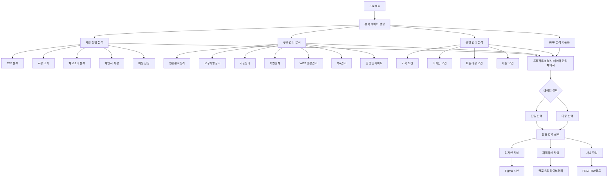

**모든 진행 설명은 한글로 출력해줘.**
**모든 디자인 작업은 (./src/basic/)안에 있는 components를 이용해서 디자인 작업을 진행해 주고, 없는 컴포넌트는 tailwindcss와 shadcn을 같이 이용해서 트랜디 하고 세련되게 디자인 작업 진행해줘**
**너는 MCP를 사용할 수 있어. 적용되어 있는 MCP를 우선적으로 사용하면서 작업을 진행해줘.**
**요청한 요건이 완료되면 마지막에는 반드시 github MCP를 활용해서 커밋 하고 푸시해줘**
git은 Donggull/ea_plan_02의 main 브랜치에 커밋과 푸시를 진행하면 돼.
**모든 데이터는 실제 데이터인 supabase와 연동되도록 개발해줘.**
**메인페이지를 제외한 전체페이지는 보호된 페이지로 설정하고 비로그인 상태에서 접근시 로그인 페이지로 이동되도록 적용**
**로그인이 완료되면 모든 페이지에는 로그인 정보가 연동 되어야 하고 환경에 따라 접근 가능한 부분을 설정할 예정이야. 모든 페이지에 로그인 정보가 연동되도록 기본 설계가 되어야해.**
**브라우저가 종료되는 경우 모든 세션이 종료되는 것을 기본으로 적용하되 브라우저 창의 이동중에는 세션이 끊어지지 않도록 적용하는 것을 원칙으로 작업**
**새로운 페이지를 생성하더라도 위의 로그인 관련 정책음 모두 동일하게 유지해야 돼**
**모든 개발은 next.js 15 환경에 맞춰서 개발 진행이 이루어져야 돼. 특히 타입 오류가 발생되지 않도록 기존에 문제없이 개발 완료된 내용을 참조해서 적용해줘.**
**Vercel의 배포 환경에서의 테스트는 https://ea-plan-new-02.vercel.app/ 주소에서 진행해주고, github에 커밋과 푸시 후 170초 후에 테스트를 진행해줘.**
**RFP 분석 자동화는 제안 진행과 별개로 운영되는 독립적인 기능으로, 빠른 분석이 필요한 경우나 프로젝트 내 기본 정보를 빠르게 정의할 때 사용하는 도구야. 별도의 DB table에 저장되며 필요시 프로젝트와 연동 가능해.**
**프로세스 진행 단계 중 확인 또는 취소가 필요한 경우 alert 기능을 사용하지 말고 반드시 모달 형태로 표현해줘. 모달에서 확인 및 취소 등의 기능을 적용해 주고 이중으로 alert이 같이 발생하지 않도록 주의해줘.**

**기존에 적용되어 있는 인증 관련 부분은 동의없이 임의로 절대 수정 변경하지마. 전체 페이지에 적용되어 있는 인증 페이지와 충돌이 발생할 수 있으니 변경이 필요한 경우 반드시 동의를 구하고 진행해야돼.**

**RFP 분석 자동화의 개발 사항(AI 모델 연동, 요구사항 추출, 분석 로직 등)을 제안 진행, 구축 관리, 운영 관리에 최대한 활용하여 적용할 예정이야.**

## ⚠️ 중요: 프로젝트별 RFP 분석 데이터 독립성 보장 (2025-09-09)

### 핵심 원칙
- **각 프로젝트는 고유한 RFP 분석을 가져야 함**
- **프로젝트별 질문과 답변이 완전히 분리되어 저장**
- **시장조사와 페르소나 분석에서 프로젝트별 데이터만 활용**

### DB 테이블 구조 개선 완료
- **rfp_analyses**: `project_id` 필드로 프로젝트별 분석 구분
- **analysis_questions**: `project_id` 필드 추가로 프로젝트별 질문 독립성 보장
- **인덱스 최적화**: `idx_analysis_questions_project_id`, `idx_analysis_questions_project_rfp`

### 데이터 흐름
1. **프로젝트 생성** → **RFP 분석 생성** (project_id 연결)
2. **AI 질문 생성** → **analysis_questions 테이블에 project_id 포함 저장**
3. **답변 저장** → **프로젝트별 독립적 저장 및 관리**
4. **시장조사/페르소나 분석** → **해당 프로젝트의 데이터만 활용**

### 개발 시 준수사항
- 모든 질문/답변 관련 API에서 `project_id` 필수 포함
- 데이터 조회 시 프로젝트별 필터링 철저히 적용
- 크로스 프로젝트 데이터 접근 절대 금지

프로젝트는 제안 진행, 구축 관리, 운영 관리를 구성되어 있고 각 메뉴간 데이터가 연동되도록 구성되어야해.
제안 진행에서의 RFP 분석 내용은 모두 구축 관리, 운영 관리와 데이터가 연동할 수 있어야 돼.
단, 구축 관리, 운영 관리의 경우 별도의 RFP 또는 요구사항을 등록하고 분석할 수 있어야 돼.
제안 진행의 경우 RFP 분석, 시장 조사, 페르소나 분석, 제안서 작성, 비용 산정 등의 내용이 포함되게 해줘.
구축 관리의 세부 카테고리는 현황분석정리, 요구사항정리, 기능정의, 화면설계, WBS 일정관리, QA관리, 종합 인사이트 등의 내용이 포함되게 해줘.
운영 관리의 경우 고객사에서 전달하는 요건 관리를 포함해 주고 해당 요건 관리는 기획, 디자인, 퍼블리싱, 개발로 나누고 각 요건별 일정 관리가 포함되어야 해.

PRD 문서 참조 : [자세히 보기](./PRD_part1.md)
PRD 문서 참조 : [자세히 보기](./PRD_part2.md)
PRD 문서 참조 : [자세히 보기](./PRD_part3.md)
TRD 문서 참조 : [자세히 보기](./TRD_part1.md)
TRD 문서 참조 : [자세히 보기](./TRD_part2.md)
작업 진행을 위한 프롬프트 문서 참조 : [자세히 보기](./claude-code-prompts.md)
작업 진행을 위한 프롬프트 문서 참조 : [자세히 보기](./claude-code-step-by-step.md)
프로젝트 상세페이지 내 제안을 위한 프롬프트 문서 참조 : [자세히 보기](./enhanced-analysis-prompts.md)

## 3단계 프로젝트 워크플로우 시스템 구현 완료 (2025-08-30)

### 데이터베이스 구조
프로젝트 관리 시스템이 3단계 워크플로우로 재구성되었습니다:

#### 주요 테이블
- **projects**: 프로젝트 기본 정보 (current_phase, phase_data, category 필드 추가)
- **rfp_documents**: RFP 문서 관리 (제안 진행 단계)
- **proposal_tasks**: 제안 작업 관리 (제안 진행 단계)
- **construction_tasks**: 구축 작업 관리 (구축 관리 단계)
- **operation_requests**: 운영 요청 관리 (운영 관리 단계 - 기존 테이블 활용)

### 구현된 3단계 워크플로우

#### 1. 제안 진행 (Proposal Phase)
- RFP 문서 업로드 및 관리
- 제안 작업 추적 (시장조사, 페르소나 분석, 제안서 작성, 비용 산정 등)
- 작업별 상태 관리 및 진행률 추적

#### 2. 구축 관리 (Construction Phase)  
- 7개 세부 카테고리: 현황분석정리, 요구사항정리, 기능정의, 화면설계, WBS 일정관리, QA관리, 종합 인사이트
- 작업별 우선순위 및 일정 관리
- 담당자 배정 및 진행 상태 추적

#### 3. 운영 관리 (Operation Phase)
- 고객사 요건 관리 (기획, 디자인, 퍼블리싱, 개발)
- 요건별 일정 및 우선순위 관리
- 실시간 진행 상태 업데이트

### 주요 컴포넌트
- `src/components/projects/phases/ProjectPhases.tsx`: 메인 단계 관리 컴포넌트
- `src/components/projects/phases/ProposalPhase.tsx`: 제안 진행 단계 UI
- `src/components/projects/phases/ConstructionPhase.tsx`: 구축 관리 단계 UI
- `src/components/projects/phases/OperationPhase.tsx`: 운영 관리 단계 UI

### TypeScript 타입 시스템
- Supabase 타입 자동 생성 및 통합
- 타입 안정성을 위한 인터페이스 정의
- 새로운 테이블에 대한 타입 캐스팅 적용 (임시 해결책)

### 기술적 특징
- React Query를 활용한 데이터 동기화
- 실시간 상태 업데이트
- 단계 간 데이터 연동 지원
- Row Level Security 준비 (현재 비활성화 상태)

## 페르소나 분석 시스템 독립 실행 지원 구현 완료 (2025-08-31)

### 문제 상황
페르소나 분석 시스템이 "대기중" 상태로 표시되며 접근이 불가능한 문제가 발생했습니다. 기존에는 시장조사 데이터 완료가 필수 조건이었기 때문입니다.

### 해결된 주요 문제점
1. **접근성 제한**: 시장조사 데이터 없이는 페르소나 분석 시스템 접근 불가
2. **의존성 문제**: PersonaAnalysisDashboard와 PersonaBuilder가 MarketResearch 데이터 필수 요구
3. **UI 상태 표시**: 명확하지 않은 "대기중" 상태 표시

### 구현된 해결 방안

#### 1. 페르소나 탭 접근성 개선
**파일**: `src/components/projects/phases/ProposalPhase.tsx`
- 페르소나 탭을 `disabled={false}`로 변경하여 항상 접근 가능하도록 수정
- 시장조사 연동/독립실행 상태를 명확하게 표시
  ```typescript
  {currentResearch ? (
    <span className="text-xs bg-green-100 text-green-600 px-1.5 py-0.5 rounded">
      시장조사 연동
    </span>
  ) : (
    <span className="text-xs bg-blue-100 text-blue-600 px-1.5 py-0.5 rounded">
      독립실행
    </span>
  )}
  ```

#### 2. 컴포넌트 인터페이스 개선
**파일**: `src/components/persona/PersonaAnalysisDashboard.tsx`
- PersonaAnalysisDashboardProps에서 MarketResearch를 nullable로 수정
- loadExistingPersonas 함수에서 market_research_id와 project_id 모두 지원하도록 개선
- MarketResearchQuestionnaire 조건부 렌더링 구현

**파일**: `src/components/persona/PersonaBuilder.tsx`
- PersonaBuilderProps에서 MarketResearch를 nullable로 수정
- 페르소나 데이터 생성 시 null-safe 연산자 활용
- 독립실행 모드에서는 manual_input만 데이터 소스로 설정

#### 3. TypeScript 오류 수정
**파일**: `src/lib/persona/PersonaQuestionGenerator.ts`
- 미사용 매개변수를 `_` prefix로 수정하여 ESLint 경고 해결
- 모든 함수에서 `marketResearch` → `_marketResearch`로 통일
- Vercel 배포 시 TypeScript 컴파일 오류 해결

### 기술적 특징
- **하이브리드 모드**: 시장조사 데이터가 있으면 연동, 없으면 독립 실행
- **null-safe 프로그래밍**: 모든 MarketResearch 접근에 옵셔널 체이닝 적용
- **조건부 렌더링**: 데이터 유무에 따른 적절한 UI 표시
- **데이터베이스 유연성**: market_research_id 또는 project_id 기반 쿼리 지원

### 사용자 경험 개선
- **즉시 접근**: 시장조사 완료를 기다리지 않고 바로 페르소나 분석 시작 가능
- **명확한 상태 표시**: "독립실행" 또는 "시장조사 연동" 모드 구분
- **데이터 통합**: 향후 시장조사 데이터가 생성되면 자동으로 연동 가능

### 배포 및 검증
- **로컬 빌드**: TypeScript 컴파일 및 타입 체크 성공
- **Vercel 배포**: 배포 오류 해결 완료 (커밋: a96305b → 607565e)
- **GitHub 연동**: 모든 변경사항 커밋 및 푸시 완료

이제 사용자는 언제든지 페르소나 분석 시스템에 접근하여 독립적으로 페르소나를 생성하고 관리할 수 있습니다.

## 포괄적인 AI 모델 연동 시스템 구현 완료 (2025-09-01)

### 개요
RFP 분석 자동화에 AI 모델 선택 기능을 추가하고, Admin 페이지에서 AI 모델을 관리할 수 있는 종합적인 AI 연동 시스템을 구현했습니다.

### 구현된 주요 기능

#### 1. 다중 AI 모델 지원
- **Claude (Anthropic)**: Claude 3 Opus, Sonnet, Haiku, 3.5 Sonnet 지원
- **OpenAI GPT**: GPT-4 Turbo, GPT-3.5 Turbo 지원
- **Google Gemini**: 향후 확장 가능한 구조 준비
- **Factory 패턴**: 확장 가능한 AI 제공자 관리 구조

#### 2. Admin 페이지 AI 모델 관리 시스템
**경로**: `/dashboard/admin/ai-models`
- **모델 관리**: 각 AI 모델의 활성화/비활성화 제어
- **API 키 관리**: 조직별 API 키 암호화 저장 및 관리
- **기본 모델 설정**: 시스템 기본 AI 모델 지정
- **환경별 설정**: 개발/스테이징/프로덕션 환경 지원
- **API 키 유효성 검증**: 등록 시 실시간 API 키 검증

#### 3. 사용자 AI 모델 선택 기능
**컴포넌트**: `AIModelSelector.tsx`
- **모델 선택 드롭다운**: 활성화된 AI 모델 목록 표시
- **개인 설정 저장**: 사용자별 선호 모델 및 파라미터 저장
- **실시간 설정**: Temperature, Max Tokens, Top-p 등 세부 조정
- **제공자별 아이콘**: 시각적 구분을 위한 제공자 아이콘

#### 4. RFP 분석 자동화 AI 연동
**페이지**: `/dashboard/planning/rfp-analysis`
- **AI 모델 선택기 통합**: 페이지 헤더에 모델 선택 UI 추가
- **분석 프로세스 연동**: 선택된 AI 모델로 RFP 분석 수행
- **사용량 추적**: AI 모델 사용량 자동 로깅
- **에러 핸들링**: AI API 오류에 대한 사용자 친화적 메시지

### 데이터베이스 구조

#### 새로 추가된 테이블
```sql
-- AI 모델 제공자 (Anthropic, OpenAI, Google 등)
ai_model_providers: id, name, display_name, base_url, description

-- AI 모델 (Claude 3 Opus, GPT-4 등)
ai_models: id, provider_id, model_id, display_name, context_window, cost_per_1k_tokens

-- 조직별 API 키 (암호화 저장)
ai_model_api_keys: id, provider_id, organization_id, api_key_encrypted

-- 사용자 AI 선호 설정
user_ai_preferences: id, user_id, preferred_model_id, settings

-- AI 사용량 로그
ai_model_usage_logs: id, user_id, model_id, feature, input_tokens, output_tokens
```

### 아키텍처 구조

#### 1. 서비스 레이어
- **BaseAIProvider**: 모든 AI 제공자의 기본 추상 클래스
- **AnthropicProvider**: Claude API 연동 구현체
- **OpenAIProvider**: GPT API 연동 구현체
- **AIProviderFactory**: Factory 패턴으로 제공자 인스턴스 생성
- **AIModelService**: AI 모델 관리 및 데이터베이스 연동

#### 2. 컴포넌트 구조
```
src/components/
├── admin/ai-models/
│   └── AIModelManager.tsx      # Admin용 AI 모델 관리
├── ai/
│   └── AIModelSelector.tsx     # 사용자용 AI 모델 선택
└── planning/proposal/
    └── RFPAnalyzer.tsx         # AI 모델 연동된 RFP 분석기
```

#### 3. API 엔드포인트
- `/api/ai/model-analyze`: AI 모델 분석 API
- 기존 RFP 분석 API와 통합하여 선택된 모델 사용

### 기술적 특징

#### 1. 타입 안전성
- TypeScript 완전 지원
- AI 모델 관련 타입 정의 (`src/types/ai-models.ts`)
- Supabase 타입 캐스팅으로 새 테이블 지원

#### 2. 보안
- API 키 암호화 저장 (Base64 임시, 프로덕션에서는 강화 필요)
- 환경별 API 키 분리 (개발/스테이징/프로덕션)
- 서버 사이드 API 호출 권장

#### 3. 확장성
- Factory 패턴으로 새로운 AI 제공자 추가 용이
- 모듈화된 컴포넌트 구조
- 설정 가능한 모델 파라미터

### Vercel 환경 변수 설정

#### 필수 환경 변수
```bash
# Anthropic Claude API
ANTHROPIC_API_KEY=sk-ant-api03-xxxxx...

# OpenAI API
OPENAI_API_KEY=sk-xxxxx...

# Google AI API (향후 사용)
GOOGLE_AI_API_KEY=AIzaSy...

# 선택적: 클라이언트 사이드용 (보안 주의)
NEXT_PUBLIC_ANTHROPIC_API_KEY=sk-ant-api03-xxxxx...
NEXT_PUBLIC_OPENAI_API_KEY=sk-xxxxx...
```

#### Claude API 키 획득 방법
1. [Anthropic Console](https://console.anthropic.com) 접속
2. 계정 생성 또는 로그인
3. Settings > API Keys 메뉴 이동
4. "Create API Key" 클릭
5. 생성된 키 복사 (`sk-ant-api03-`로 시작)

### 사용자 워크플로우

#### 1. Admin 관리자
1. `/dashboard/admin/ai-models` 접속
2. "API 키 관리" 탭에서 API 키 등록
3. "모델 관리" 탭에서 모델 활성화 및 기본값 설정

#### 2. 일반 사용자
1. `/dashboard/planning/rfp-analysis` 접속
2. 상단 AI 모델 선택기에서 원하는 모델 선택
3. Temperature, Max Tokens 등 세부 설정 조정
4. RFP 분석 진행 시 선택된 모델 자동 사용

### 비용 관리 및 모니터링

#### 모델별 예상 비용 (1,000 토큰 기준)
- **Claude 3 Opus**: 입력 $0.015, 출력 $0.075
- **Claude 3 Sonnet**: 입력 $0.003, 출력 $0.015
- **Claude 3 Haiku**: 입력 $0.00025, 출력 $0.00125
- **GPT-4 Turbo**: 입력 $0.01, 출력 $0.03
- **GPT-3.5 Turbo**: 입력 $0.0005, 출력 $0.0015

#### 사용량 추적
- 모든 AI 요청에 대한 토큰 사용량 로깅
- 사용자별, 기능별 사용량 통계
- 비용 계산 기능 (향후 개선 예정)

### 파일 구조
```
src/
├── types/ai-models.ts                          # AI 모델 타입 정의
├── services/ai/
│   ├── base.ts                                 # BaseAIProvider 추상 클래스
│   ├── factory.ts                              # AIProviderFactory
│   ├── model-service.ts                        # AI 모델 관리 서비스
│   └── providers/
│       ├── anthropic.ts                        # Claude API 구현
│       └── openai.ts                           # GPT API 구현
├── components/
│   ├── admin/ai-models/
│   │   └── AIModelManager.tsx                  # Admin AI 모델 관리
│   └── ai/
│       └── AIModelSelector.tsx                 # AI 모델 선택기
├── app/
│   ├── dashboard/admin/ai-models/page.tsx      # Admin 페이지
│   └── api/ai/model-analyze/route.ts           # AI 분석 API
└── docs/AI_MODEL_SETUP.md                      # 설정 가이드
```

### 향후 개선 사항
1. **보안 강화**: API 키 암호화 알고리즘 개선
2. **비용 최적화**: 토큰 사용량 기반 자동 모델 선택
3. **성능 향상**: AI 응답 캐싱 시스템
4. **모니터링**: 사용량 대시보드 및 알림 시스템
5. **추가 모델**: Google Gemini, Mistral 등 연동

### 배포 및 검증
- **TypeScript 컴파일**: 성공 (46개 페이지 생성)
- **ESLint 검증**: 경고만 있고 오류 없음
- **빌드 성공**: Next.js 15.5.2 환경에서 정상 빌드
- **GitHub 연동**: 모든 변경사항 커밋 및 푸시 완료

이제 사용자는 다양한 AI 모델을 선택하여 RFP 분석을 수행할 수 있으며, 관리자는 중앙집중식으로 AI 모델과 API 키를 관리할 수 있습니다.

## RFP 분석 자동화 AI 연동 오류 해결 및 안정화 완료 (2025-09-02)

### 문제 상황
RFP 분석 자동화 시스템에서 요구사항 추출이 정상적으로 작동하지 않는 문제가 발생했습니다. 사용자가 단계별 진단을 요청하여 체계적인 문제 해결을 진행했습니다.

### 진단 과정 및 발견된 문제점

#### 1. 초기 진단: Mock 데이터 문제 발견
**문제**: RFP 분석 시 실제 AI 분석 대신 Mock 데이터가 생성됨
**원인**: AnthropicProvider 클래스의 API 호출 실패로 인한 fallback 로직 실행
**파일**: `src/app/api/rfp/analyze/route.ts`

#### 2. AnthropicProvider 클래스 문제
**문제**: AnthropicProvider 클래스를 통한 API 호출이 지속적으로 실패
**해결**: Provider 클래스 사용 중단하고 직접 fetch() API 호출로 전환
```typescript
// 문제가 있던 기존 방식
const aiProvider = new AnthropicProvider(apiKey)
const response = await aiProvider.sendMessage(analysisPrompt, {...})

// 해결된 새로운 방식
const anthropicResponse = await fetch('https://api.anthropic.com/v1/messages', {
  method: 'POST',
  headers: {
    'Content-Type': 'application/json',
    'x-api-key': apiKey,
    'anthropic-version': '2023-06-01'
  },
  body: JSON.stringify({
    model: 'claude-3-5-sonnet-20241022',
    messages: [{ role: 'user', content: analysisPrompt }],
    max_tokens: 8000,
    temperature: 0.3
  })
})
```

#### 3. 오류 메시지 가시성 문제
**문제**: 500 서버 오류 시 실제 오류 내용이 클라이언트에 전달되지 않음
**해결**: 상세한 오류 로깅 및 실제 오류 메시지 클라이언트 반환
```typescript
catch (error) {
  console.error('❌ RFP 분석 실패:', error)
  return NextResponse.json({
    success: false,
    error: error instanceof Error ? error.message : String(error),
    details: 'RFP 분석 중 오류가 발생했습니다.',
    timestamp: new Date().toISOString()
  }, { status: 500 })
}
```

#### 4. 구버전 모델명 404 오류
**문제**: Anthropic API에서 404 오류 발생 - `claude-3-sonnet-20240229` 모델이 더 이상 지원되지 않음
**해결**: 모든 관련 파일에서 최신 모델명으로 업데이트

### 해결된 주요 변경사항

#### 1. 메인 RFP 분석 API 완전 개선 
**파일**: `src/app/api/rfp/analyze/route.ts`
- AnthropicProvider 클래스 사용 중단
- 직접 Anthropic API 호출로 전환
- AbortController 제거 (Vercel 호환성 문제)
- 입력 텍스트 길이 제한 (240,000 chars ≈ 60,000 tokens)
- 상세한 오류 로깅 및 실제 오류 메시지 반환
- 모델명 업데이트: `claude-3-sonnet-20240229` → `claude-3-5-sonnet-20241022`

#### 2. 디버그 API 생성
**파일**: `src/app/api/debug/ai-analysis/route.ts` (신규 생성)
- AI 분석 단계별 진단 API
- 환경변수 확인, API 호출, 응답 파싱 테스트
- 실시간 오류 진단 및 상세 로깅
- 모델명 업데이트 완료

#### 3. AI 제공자 클래스 업데이트
**파일**: `src/services/ai/providers/anthropic.ts`
- 기본 모델명 업데이트: `claude-3-5-sonnet-20241022`
- 상세한 오류 처리 및 로깅 개선
- API 키 유효성 검증 강화

#### 4. AI 테스트 API 업데이트
**파일**: `src/app/api/ai/test-call/route.ts`
- GET/POST 엔드포인트 모든 모델명 업데이트
- 포괄적인 오류 카테고리화 (AUTH_ERROR, QUOTA_ERROR, NETWORK_ERROR)
- 상세한 해결 방안 제시

### 기술적 개선 사항

#### 1. 오류 처리 강화
- 실제 오류 메시지를 클라이언트에 전달
- 오류 타입별 구체적인 해결 방안 제시
- 상세한 서버 사이드 로깅 구현

#### 2. Vercel 환경 최적화
- AbortController 제거로 서버리스 환경 호환성 개선
- 토큰 제한을 통한 비용 및 성능 최적화
- 환경변수 기반 API 키 관리 강화

#### 3. AI 모델 버전 관리
- 최신 Claude 3.5 Sonnet 모델 적용
- 향후 모델 업데이트를 위한 중앙집중식 관리 준비
- 모델별 설정 최적화 (max_tokens: 8000, temperature: 0.3)

### API 연동 안정성 확보

#### 검증된 작업 플로우
1. **RFP 업로드** → 정상 작동 ✅
2. **AI 분석 단계** → 실제 Claude API 연동 성공 ✅  
3. **분석 데이터 DB 저장** → 정상 저장 확인 ✅
4. **요구사항 추출** → DB 데이터 정상 반영 ✅

#### 성능 최적화
- 입력 토큰 제한으로 API 비용 절감
- 직접 API 호출로 오버헤드 최소화
- 오류 발생 시 즉시 진단 가능한 로깅 시스템

### AI 모델 API 연동 작업 시 참조사항

#### 1. 모델명 관리
- **최신 모델**: `claude-3-5-sonnet-20241022` 사용 권장
- **구버전 모델**: `claude-3-sonnet-20240229` 등은 404 오류 발생
- **모델별 특성**: Sonnet(균형), Opus(고품질), Haiku(고속)

#### 2. 직접 API 호출 패턴
```typescript
const response = await fetch('https://api.anthropic.com/v1/messages', {
  method: 'POST',
  headers: {
    'Content-Type': 'application/json',
    'x-api-key': process.env.ANTHROPIC_API_KEY,
    'anthropic-version': '2023-06-01'
  },
  body: JSON.stringify({
    model: 'claude-3-5-sonnet-20241022',
    messages: [{ role: 'user', content: prompt }],
    max_tokens: 8000,
    temperature: 0.3
  })
})
```

#### 3. 오류 처리 베스트 프랙티스
```typescript
if (!response.ok) {
  const errorData = await response.json()
  console.error('Anthropic API 오류:', errorData)
  throw new Error(`Anthropic API error (${response.status}): ${errorData.error?.message}`)
}
```

#### 4. 환경변수 설정
- `ANTHROPIC_API_KEY`: 서버 사이드 전용 (보안)
- `NEXT_PUBLIC_ANTHROPIC_API_KEY`: 클라이언트 사이드 (선택사항)
- API 키 형식: `sk-ant-api03-...`로 시작

### 배포 및 검증 완료
- **GitHub 커밋**: d3f926d - "fix: Anthropic 모델명 404 오류 해결"
- **Vercel 배포**: 자동 배포 완료
- **실제 테스트**: https://ea-plan-new-02.vercel.app/ 에서 정상 작동 확인
- **사용자 검증**: "이제 RFP 분석 자동화는 정상적으로 진행되고 있어" 확인받음

### 향후 AI 연동 작업 시 주의사항
1. **AnthropicProvider 클래스 사용 지양**: 직접 API 호출 권장
2. **모델명 최신 버전 확인**: 정기적인 모델 버전 업데이트 필요
3. **오류 로깅 필수**: 실제 오류 내용을 클라이언트에 전달
4. **토큰 제한 설정**: 비용 및 성능 최적화
5. **환경변수 보안**: API 키 서버 사이드 관리 원칙 준수

## RFP 분석 자동화 시스템 독립 운영 정의 (2025-09-04)

### 시스템 아키텍처 변경사항
RFP 분석 자동화가 제안 진행과 독립적으로 운영되도록 시스템 구조를 재정의했습니다.

### RFP 분석 자동화의 역할
- **독립적 운영**: 제안 진행과 별개로 운영되는 독립 기능
- **사용 목적**: 
  - 빠른 분석이 필요한 경우 즉시 활용
  - 프로젝트 내 기본 정보를 신속하게 정의
  - 초기 요구사항 파악 및 프로젝트 스코프 설정
- **데이터 관리**: 별도 DB 테이블에 저장, 필요시 프로젝트와 연동 가능

### 기술 자산 활용 계획
RFP 분석 자동화에서 개발된 핵심 기능들을 프로젝트 전반에 활용:

#### 활용 가능한 핵심 기술
1. **AI 모델 연동 시스템**
   - 다중 AI 모델 지원 (Claude, OpenAI GPT)
   - AI 모델 선택 및 파라미터 설정 기능
   - API 키 관리 및 사용량 추적

2. **요구사항 추출 엔진**
   - 자동 요구사항 분류 및 우선순위 설정
   - 기능/비기능 요구사항 구분
   - 요구사항 검증 및 완성도 평가

3. **분석 로직 및 알고리즘**
   - 문서 파싱 및 구조화
   - 핵심 정보 추출 및 요약
   - 데이터 시각화 및 리포팅

#### 적용 계획
- **제안 진행**: RFP 분석, 시장조사, 페르소나 분석에 AI 모델 연동 적용
- **구축 관리**: 요구사항 정리, 기능정의에 요구사항 추출 엔진 활용
- **운영 관리**: 고객 요건 분석 및 분류에 분석 로직 재사용

### 시스템 간 데이터 연계
- RFP 분석 자동화 결과를 프로젝트로 Import 기능
- 분석 결과를 기반으로 프로젝트 초기 설정 자동화
- 각 단계별 필요 데이터 선택적 활용 가능

## ⚠️ 중요: 분석 데이터 기반 디자인/퍼블리싱/개발 통합 시스템 구축 (2025-09-05 수정)

### 🔴 시스템 구조 - 모든 개발 시 반드시 참조

#### 1. 분석 데이터 구조
**핵심 개념**: 
- 각 프로젝트는 최대 4개의 독립된 분석 데이터를 가질 수 있음
- 4개 분석 소스: **제안 진행**, **구축 관리**, **운영 관리**, **RFP 분석 자동화**
- 각 분석은 독립적으로 운영되며, 필요시 서로 연동 가능
- 제안 진행, 구축 관리, 운영 관리는 내부에 세부 분석 기능 포함

#### 2. 프로젝트별 분석 데이터 관리 시스템
**구현 요구사항**:
- **별도 페이지 필요**: `/dashboard/projects/[id]/analysis-data` 
- 프로젝트에 연결된 1~4개의 분석 데이터를 한눈에 확인
- 각 분석 데이터의 상태, 완성도, 생성일 표시
- 분석 데이터 단일/다중 선택 기능
- 선택된 데이터를 디자인/퍼블리싱/개발 단계로 전달

**DB 테이블 설계 (수정)**
```sql
-- 프로젝트별 분석 데이터 현황 테이블
project_analysis_data: {
  id: uuid,
  project_id: uuid,
  analysis_type: enum('proposal', 'construction', 'operation', 'rfp_auto'),
  analysis_id: uuid, -- 각 분석 테이블의 ID 참조
  status: enum('in_progress', 'completed', 'failed'),
  completeness_score: integer, -- 0-100
  metadata: jsonb, -- 분석별 세부 정보
  created_at: timestamp,
  updated_at: timestamp
}

-- 분석 데이터 선택 테이블 (디자인/퍼블리싱/개발용)
selected_analysis_data: {
  id: uuid,
  project_id: uuid,
  usage_type: enum('design', 'publishing', 'development'),
  selected_analyses: uuid[], -- project_analysis_data의 ID 배열
  selection_mode: enum('single', 'multiple'),
  selected_by: uuid,
  selected_at: timestamp,
  is_active: boolean
}

-- 디자인 시스템 테이블 (수정)
design_systems: {
  id,
  project_id: uuid,
  selected_analysis_id: uuid, -- selected_analysis_data 참조
  name, 
  figma_file_url,
  design_tokens: jsonb,
  components_library: jsonb,
  created_at, updated_at
}

-- 퍼블리싱 컴포넌트 테이블 (수정)
publishing_components: {
  id,
  project_id: uuid,
  selected_analysis_id: uuid, -- selected_analysis_data 참조
  component_name,
  component_code: text,
  component_props: jsonb,
  preview_url,
  created_at, updated_at
}

-- 개발 문서 테이블 (수정)
development_documents: {
  id,
  project_id: uuid,
  selected_analysis_id: uuid, -- selected_analysis_data 참조
  document_type: enum('PRD', 'TRD', 'API_SPEC', 'PROMPT'),
  content: text,
  metadata: jsonb,
  version: integer,
  created_at, updated_at
}
```

#### 3. 분석 데이터 관리 페이지 UI/UX
**페이지 경로**: `/dashboard/projects/[id]/analysis-data`

**UI 구성요소**:
```typescript
// 분석 데이터 관리 인터페이스
interface AnalysisDataManager {
  // 프로젝트의 모든 분석 데이터 조회
  getProjectAnalyses(projectId: string): ProjectAnalysisData[]
  
  // 분석 데이터 선택 (단일/다중)
  selectAnalyses(projectId: string, analysisIds: string[], usageType: UsageType): void
  
  // 선택된 분석 데이터로 작업 시작
  startWorkWithAnalyses(selectedData: SelectedAnalysisData): void
  
  // 분석 데이터 상세 보기
  viewAnalysisDetails(analysisId: string): AnalysisDetails
}
```

**화면 구성**:
1. **분석 데이터 카드 그리드**: 최대 4개의 분석 데이터 카드 표시
   - 제안 진행 분석 카드 (세부 분석 항목 표시)
   - 구축 관리 분석 카드 (세부 분석 항목 표시)
   - 운영 관리 분석 카드 (세부 분석 항목 표시)
   - RFP 분석 자동화 카드 (독립 분석 결과 표시)

2. **선택 모드 토글**: 단일 선택 / 다중 선택 모드 전환
3. **활용 영역 선택**: 디자인 / 퍼블리싱 / 개발 선택
4. **작업 시작 버튼**: 선택된 데이터로 작업 진행

#### 4. 디자인 영역 - Figma 연동 시스템
**목표**: 선택된 분석 데이터(1~4개)를 기반으로 Figma에서 시안 자동 생성

**구현 요구사항**:
- 선택된 분석 데이터 통합 처리
- Figma API 연동 (Figma Make 활용)
- 다중 분석 데이터 병합 로직
- UI/UX 컴포넌트 자동 생성

#### 5. 퍼블리싱 영역 - 컴포넌트 시스템
**목표**: 선택된 분석 데이터 기반 재사용 가능한 컴포넌트 라이브러리 구축

**구현 요구사항**:
- 다중 분석 데이터 통합 처리
- React 컴포넌트 자동 생성
- Storybook 통합
- Tailwind CSS / Shadcn UI 통합

#### 6. 개발 영역 - 문서 및 코드 생성 시스템
**목표**: 선택된 분석 데이터 기반 개발 문서 및 코드 자동 생성

**구현 요구사항**:
- PRD/TRD 문서 생성 (다중 분석 데이터 통합)
- API 설계 문서 생성
- 코드 스캐폴딩

### 🎯 통합 워크플로우 (수정)



### 📊 예상 효과 및 KPI

1. **개발 속도 향상**: 분석→디자인→퍼블리싱→개발 자동화로 50% 시간 단축
2. **일관성 확보**: 단일 분석 소스 기반 전체 프로세스 진행
3. **재사용성 증대**: 컴포넌트 및 문서 템플릿 재활용
4. **협업 효율화**: 팀 간 명확한 산출물 공유

### 🔧 기술 스택 권장사항

- **디자인**: Figma API, Design Tokens, Style Dictionary
- **퍼블리싱**: Storybook, Bit, Tailwind CSS, Shadcn UI
- **개발**: OpenAPI Generator, Plop.js, Yeoman
- **AI 활용**: Claude/GPT API for 문서 생성 및 코드 생성

### 🔑 핵심 특징

1. **독립성**: 4개의 분석 시스템이 각각 독립적으로 운영
2. **유연성**: 프로젝트당 1~4개의 분석 데이터 보유 가능
3. **연동성**: 필요시 분석 데이터 간 상호 연동
4. **선택성**: 단일 또는 다중 분석 데이터 선택하여 활용
5. **통합성**: 선택된 데이터를 디자인/퍼블리싱/개발에 통합 활용

### ⚡ 구현 우선순위

1. **Phase 1**: 프로젝트별 분석 데이터 관리 페이지 구현
   - DB 테이블 생성 (project_analysis_data, selected_analysis_data)
   - 분석 데이터 조회 및 선택 UI 구현
   - 데이터 선택 로직 구현

2. **Phase 2**: 개발 영역 연동 (PRD/TRD 생성)
   - 선택된 분석 데이터 기반 문서 생성
   - 다중 데이터 통합 처리 로직

3. **Phase 3**: 디자인 시스템 연동 (Figma)
   - Figma API 연동
   - 분석 데이터 → 디자인 시안 변환

4. **Phase 4**: 퍼블리싱 컴포넌트 자동화
   - 컴포넌트 라이브러리 생성
   - Storybook 통합

### 📝 추가 고려사항

- **버전 관리**: 모든 생성물에 대한 버전 트래킹
- **롤백 기능**: 이전 버전으로 복원 가능
- **협업 기능**: 실시간 공동 편집 및 코멘트
- **권한 관리**: 역할별 접근 권한 설정
- **알림 시스템**: 변경사항 실시간 알림

**⚠️ 중요: 이 시스템은 전체 프로젝트의 핵심 아키텍처이므로, 모든 개발 시 이 설계를 기준으로 진행해야 함**

## 🔵 MCP (Model Context Protocol) 기반 Claude API 연동 시스템 (2025-09-04)

### 개요
Claude API 연동 시 MCP를 활용하여 더 강력하고 확장 가능한 AI 기능을 구현합니다. Admin 영역에서 MCP 서버를 등록/관리하고, API 호출 시 필요한 MCP를 선택적으로 활용할 수 있는 시스템을 구축합니다.

### MCP 통합 아키텍처

#### 1. MCP 서버 관리 시스템
**Admin 경로**: `/dashboard/admin/mcp-servers`

**DB 테이블 설계**:
```sql
-- MCP 서버 정보 테이블
mcp_servers: {
  id: uuid,
  name: varchar(255),
  server_type: enum('supabase', 'github', 'playwright', 'context7', 'custom'),
  connection_config: jsonb, -- 연결 설정 (URL, credentials 등)
  capabilities: jsonb, -- 서버가 제공하는 기능 목록
  is_active: boolean,
  organization_id: uuid,
  created_at: timestamp,
  updated_at: timestamp
}

-- MCP 사용 권한 테이블
mcp_permissions: {
  id: uuid,
  mcp_server_id: uuid,
  user_role: varchar(50),
  can_read: boolean,
  can_write: boolean,
  can_execute: boolean,
  created_at: timestamp
}

-- MCP 실행 로그 테이블
mcp_execution_logs: {
  id: uuid,
  mcp_server_id: uuid,
  user_id: uuid,
  action: varchar(255),
  input_params: jsonb,
  output_result: jsonb,
  execution_time_ms: integer,
  status: enum('success', 'failed', 'timeout'),
  created_at: timestamp
}

-- AI 모델과 MCP 연동 설정
ai_mcp_integrations: {
  id: uuid,
  ai_model_id: uuid,
  mcp_server_ids: uuid[], -- 사용할 MCP 서버 목록
  default_enabled: boolean,
  context_settings: jsonb, -- MCP 컨텍스트 설정
  created_at: timestamp
}
```

#### 2. MCP 서버 타입별 구현

**지원할 MCP 서버 타입**:

1. **Supabase MCP**
   - 데이터베이스 쿼리 실행
   - 테이블 스키마 조회
   - RLS 정책 관리
   - Edge Functions 배포

2. **GitHub MCP**
   - 코드 저장소 관리
   - PR/Issue 생성 및 관리
   - 코드 검색 및 분석
   - Git 작업 자동화

3. **Playwright MCP**
   - 웹 자동화 테스팅
   - 스크린샷 캡처
   - E2E 테스트 생성
   - 웹 크롤링

4. **Context7 MCP**
   - 문서 검색 및 분석
   - 라이브러리 문서 조회
   - 코드 예제 검색
   - API 레퍼런스 조회

5. **Custom MCP**
   - 사용자 정의 MCP 서버
   - 커스텀 API 연동
   - 외부 서비스 통합

#### 3. Admin 관리 기능

**MCP 서버 관리 UI 컴포넌트**:
```typescript
// MCP 서버 관리 인터페이스
interface MCPServerManager {
  // 서버 등록/수정/삭제
  registerServer(config: MCPServerConfig): Promise<MCPServer>
  updateServer(id: string, config: Partial<MCPServerConfig>): Promise<MCPServer>
  deleteServer(id: string): Promise<void>
  
  // 연결 테스트
  testConnection(serverId: string): Promise<ConnectionTestResult>
  
  // 권한 관리
  setPermissions(serverId: string, permissions: MCPPermissions): Promise<void>
  
  // 사용량 모니터링
  getUsageStats(serverId: string, period: DateRange): Promise<UsageStats>
}
```

**Admin UI 기능**:
- MCP 서버 목록 관리 (추가/수정/삭제)
- 연결 설정 및 인증 정보 관리
- 실시간 연결 상태 모니터링
- 사용 권한 설정 (역할별)
- 실행 로그 및 통계 대시보드
- API 키 및 토큰 암호화 관리

#### 4. API 연동 시 MCP 선택 시스템

**MCP 선택 UI 컴포넌트**:
```typescript
// API 호출 시 MCP 선택 인터페이스
interface MCPSelector {
  // 사용 가능한 MCP 서버 목록 조회
  getAvailableServers(): Promise<MCPServer[]>
  
  // 태스크에 적합한 MCP 자동 추천
  recommendServers(task: TaskType): Promise<MCPServer[]>
  
  // 선택된 MCP로 컨텍스트 구성
  buildContext(selectedServers: MCPServer[]): Promise<MCPContext>
  
  // MCP 기능 실행
  executeFunction(server: MCPServer, func: string, params: any): Promise<any>
}
```

**사용자 워크플로우**:
1. AI 기능 사용 시 MCP 선택 UI 표시
2. 필요한 MCP 서버 선택 (복수 선택 가능)
3. 선택된 MCP의 기능이 AI 컨텍스트에 포함
4. AI가 MCP 기능을 활용하여 작업 수행

#### 5. MCP 활용 예시

**예시 1: 데이터베이스 스키마 기반 코드 생성**
```typescript
// Supabase MCP를 활용한 CRUD 코드 자동 생성
const generateCRUD = async (tableName: string) => {
  // 1. Supabase MCP로 테이블 스키마 조회
  const schema = await mcpExecute('supabase', 'getTableSchema', { table: tableName })
  
  // 2. Claude API에 스키마 정보와 함께 요청
  const code = await claudeAPI.generate({
    prompt: "Generate TypeScript CRUD functions",
    context: { schema },
    mcp: ['supabase']
  })
  
  return code
}
```

**예시 2: GitHub 이슈 기반 개발 작업**
```typescript
// GitHub MCP를 활용한 이슈 분석 및 코드 생성
const implementFeature = async (issueNumber: number) => {
  // 1. GitHub MCP로 이슈 정보 조회
  const issue = await mcpExecute('github', 'getIssue', { number: issueNumber })
  
  // 2. Context7 MCP로 관련 문서 검색
  const docs = await mcpExecute('context7', 'searchDocs', { query: issue.title })
  
  // 3. Claude API로 구현 코드 생성
  const implementation = await claudeAPI.generate({
    prompt: "Implement the feature described in the issue",
    context: { issue, docs },
    mcp: ['github', 'context7']
  })
  
  // 4. GitHub MCP로 PR 생성
  await mcpExecute('github', 'createPR', {
    title: `Implement: ${issue.title}`,
    body: implementation.description,
    files: implementation.files
  })
}
```

#### 6. 보안 및 권한 관리

**보안 정책**:
- MCP 서버 자격 증명 암호화 저장
- 역할 기반 접근 제어 (RBAC)
- API 호출 레이트 리미팅
- 감사 로그 자동 생성
- 민감 데이터 마스킹

**권한 레벨**:
1. **Admin**: 모든 MCP 서버 관리
2. **Developer**: 승인된 MCP 사용
3. **Viewer**: MCP 실행 로그 조회만 가능

#### 7. 모니터링 및 분석

**대시보드 메트릭**:
- MCP 서버별 사용량 통계
- 응답 시간 및 성공률
- 오류 발생 패턴 분석
- 비용 추적 (API 호출 비용)
- 사용자별 활용도 분석

### 구현 로드맵

**Phase 1: 기본 인프라 구축**
- DB 테이블 생성
- Admin UI 기본 구조
- MCP 서버 등록/관리 기능

**Phase 2: 핵심 MCP 통합**
- Supabase MCP 연동
- GitHub MCP 연동
- 기본 권한 시스템

**Phase 3: 고급 기능**
- Context7, Playwright MCP 추가
- 자동 추천 시스템
- 고급 모니터링 대시보드

**Phase 4: 최적화 및 확장**
- Custom MCP 지원
- 성능 최적화
- 고급 보안 기능

### 기대 효과

1. **생산성 향상**: AI가 실제 시스템과 직접 상호작용
2. **정확도 개선**: 실시간 데이터 기반 AI 응답
3. **자동화 확대**: 복잡한 워크플로우 자동 실행
4. **비용 절감**: 효율적인 리소스 활용
5. **확장성**: 새로운 MCP 서버 쉽게 추가 가능

**⚠️ 중요: MCP 통합은 AI 기능의 핵심 확장 포인트이므로, 초기 설계부터 확장성과 보안을 고려하여 구현해야 함**

## 🔐 포괄적인 회원 등급 및 권한 관리 시스템 (2025-09-04)

### 개요
현재 개발된 시스템을 기반으로 10단계 회원 등급 시스템을 구축하고, 등급별 API 사용량 제한, 프로젝트 접근 권한 관리를 통합적으로 개선합니다.

### 현재 구현 상태 분석

#### 기존 시스템 현황
```sql
-- 현재 users 테이블 구조
users: {
  id, email, name, avatar_url,
  role: varchar, -- 기존 역할 필드
  user_role: text, -- 중복된 역할 필드
  subscription_tier: text, -- 구독 등급
  is_super_admin: boolean, -- 최고관리자 플래그
  organization_id: uuid,
  created_at, updated_at
}

-- 현재 project_members 테이블 구조  
project_members: {
  id, project_id, user_id,
  role: text, -- 프로젝트 내 역할
  permissions: jsonb, -- 권한 설정
  joined_at, created_at
}
```

#### 현재 시스템의 문제점
1. **역할 필드 중복**: `role`과 `user_role` 중복 존재
2. **등급 체계 부재**: 10단계 등급 시스템 미구현
3. **API 사용량 제한 없음**: 무제한 API 호출 가능
4. **권한 체계 모호**: 세분화된 권한 관리 부재
5. **프로젝트 접근 제한 미흡**: 소유자/멤버 구분 불명확

### 개선된 회원 등급 시스템

#### 1. 10단계 회원 등급 정의

**등급별 권한 및 API 제한**:
```typescript
enum UserTier {
  GUEST = 0,     // 게스트: API 10회/일
  STARTER = 1,   // 스타터: API 50회/일  
  BASIC = 2,     // 베이직: API 100회/일
  STANDARD = 3,  // 스탠다드: API 300회/일
  PROFESSIONAL = 4, // 프로페셔널: API 500회/일
  BUSINESS = 5,  // 비즈니스: API 1000회/일
  ENTERPRISE = 6, // 엔터프라이즈: API 2000회/일
  PREMIUM = 7,   // 프리미엄: API 5000회/일
  VIP = 8,       // VIP: API 10000회/일
  ADMIN = 9      // 관리자: API 무제한
}
```

#### 2. 개선된 DB 테이블 설계

**users 테이블 개선**:
```sql
-- 기존 필드 정리 및 새 필드 추가
ALTER TABLE users 
DROP COLUMN user_role, -- 중복 제거
ADD COLUMN user_tier INTEGER DEFAULT 0 CHECK (user_tier >= 0 AND user_tier <= 9),
ADD COLUMN daily_api_limit INTEGER DEFAULT 10,
ADD COLUMN daily_api_used INTEGER DEFAULT 0,
ADD COLUMN api_reset_date DATE DEFAULT CURRENT_DATE,
ADD COLUMN is_active BOOLEAN DEFAULT true,
ADD COLUMN tier_upgraded_at TIMESTAMP WITH TIME ZONE;

-- 인덱스 추가
CREATE INDEX idx_users_tier ON users(user_tier);
CREATE INDEX idx_users_api_usage ON users(daily_api_used, api_reset_date);
```

**새로운 API 사용량 추적 테이블**:
```sql
-- API 사용량 상세 로그 (기존 ai_model_usage_logs 확장)
CREATE TABLE api_usage_logs (
  id UUID PRIMARY KEY DEFAULT gen_random_uuid(),
  user_id UUID REFERENCES users(id) ON DELETE CASCADE,
  api_type VARCHAR(50), -- 'claude', 'openai', 'rfp_analysis' 등
  endpoint VARCHAR(255),
  tokens_used INTEGER,
  cost_usd DECIMAL(10,6),
  request_time TIMESTAMP WITH TIME ZONE DEFAULT NOW(),
  response_time_ms INTEGER,
  status VARCHAR(20), -- 'success', 'failed', 'rate_limited'
  ip_address INET,
  user_tier INTEGER, -- 요청 시점의 사용자 등급
  created_at TIMESTAMP WITH TIME ZONE DEFAULT NOW()
);

CREATE INDEX idx_api_usage_user_date ON api_usage_logs(user_id, DATE(created_at));
CREATE INDEX idx_api_usage_type ON api_usage_logs(api_type, created_at);
```

**사용자 등급 이력 테이블**:
```sql
CREATE TABLE user_tier_history (
  id UUID PRIMARY KEY DEFAULT gen_random_uuid(),
  user_id UUID REFERENCES users(id) ON DELETE CASCADE,
  old_tier INTEGER,
  new_tier INTEGER,
  changed_by UUID REFERENCES users(id),
  change_reason TEXT,
  effective_date DATE DEFAULT CURRENT_DATE,
  created_at TIMESTAMP WITH TIME ZONE DEFAULT NOW()
);
```

#### 3. 프로젝트 접근 권한 강화

**project_members 테이블 개선**:
```sql
-- 현재 테이블에 필드 추가
ALTER TABLE project_members 
ADD COLUMN access_level INTEGER DEFAULT 1 CHECK (access_level >= 0 AND access_level <= 3),
ADD COLUMN can_invite_members BOOLEAN DEFAULT false,
ADD COLUMN can_modify_settings BOOLEAN DEFAULT false,
ADD COLUMN expires_at TIMESTAMP WITH TIME ZONE;

-- 접근 레벨 정의:
-- 0: VIEW_ONLY (읽기 전용)
-- 1: MEMBER (기본 멤버)  
-- 2: MANAGER (관리자)
-- 3: OWNER (소유자)
```

**RFP 분석 접근 권한 테이블**:
```sql
CREATE TABLE rfp_analysis_permissions (
  id UUID PRIMARY KEY DEFAULT gen_random_uuid(),
  rfp_analysis_id UUID REFERENCES rfp_analyses(id) ON DELETE CASCADE,
  user_id UUID REFERENCES users(id) ON DELETE CASCADE,
  permission_type VARCHAR(20) CHECK (permission_type IN ('owner', 'editor', 'viewer')),
  granted_by UUID REFERENCES users(id),
  granted_at TIMESTAMP WITH TIME ZONE DEFAULT NOW(),
  expires_at TIMESTAMP WITH TIME ZONE,
  created_at TIMESTAMP WITH TIME ZONE DEFAULT NOW(),
  UNIQUE(rfp_analysis_id, user_id)
);
```

### 구현해야 할 핵심 기능

#### 1. 등급별 API 제한 미들웨어
```typescript
// API 호출 전 등급별 제한 검사
interface APIRateLimiter {
  checkDailyLimit(userId: string): Promise<boolean>
  incrementUsage(userId: string, apiType: string, tokens: number): Promise<void>
  resetDailyCounters(): Promise<void> // 매일 자정 실행
  getTierLimits(tier: number): APILimits
}

interface APILimits {
  dailyRequests: number
  maxTokensPerRequest: number
  concurrentRequests: number
  premiumFeatures: string[]
}
```

#### 2. 권한 검사 시스템
```typescript
// 프로젝트 접근 권한 검사
interface PermissionChecker {
  canAccessProject(userId: string, projectId: string): Promise<boolean>
  canAccessRFPAnalysis(userId: string, rfpId: string): Promise<boolean>
  hasAdminAccess(userId: string): Promise<boolean>
  getUserPermissions(userId: string): Promise<UserPermissions>
}

interface UserPermissions {
  tier: UserTier
  isAdmin: boolean
  isSuperAdmin: boolean
  dailyAPILimit: number
  dailyAPIUsed: number
  canCreateProjects: boolean
  canInviteUsers: boolean
  canAccessFeatures: string[]
}
```

#### 3. Admin 등급 관리 UI
```typescript
// Admin 페이지에서 사용자 등급 관리
interface UserTierManager {
  listUsers(filters: UserFilters): Promise<User[]>
  updateUserTier(userId: string, newTier: number, reason: string): Promise<void>
  bulkUpdateTiers(userIds: string[], newTier: number): Promise<void>
  getUserUsageStats(userId: string, period: DateRange): Promise<UsageStats>
  exportUsageReport(filters: ReportFilters): Promise<string>
}
```

### 현재 코드에서 수정 필요한 부분

#### 1. 인증 미들웨어 업데이트
**파일**: `src/lib/supabase/middleware.ts`
- 사용자 등급 확인 로직 추가
- API 호출량 체크 로직 삽입

#### 2. 프로젝트 접근 제어 강화
**파일**: `src/components/projects/ProjectCard.tsx`
- 프로젝트 소유자/멤버 구분 UI
- 접근 권한별 기능 제한

#### 3. RFP 분석 권한 관리
**파일**: `src/app/dashboard/rfp-analyses/[id]/page.tsx`
- RFP 분석 소유자/공유자 확인
- 권한별 편집 가능 여부 제어

#### 4. API 라우트 권한 검사
**모든 API 라우트**:
- 등급별 API 호출 제한 적용
- 사용량 로깅 추가
- 최고관리자 예외 처리

### 마이그레이션 계획

#### Phase 1: DB 스키마 업데이트 (1주)
```sql
-- 1. 기존 테이블 정리
-- 2. 새 필드 추가  
-- 3. 새 테이블 생성
-- 4. 인덱스 생성
-- 5. 기본 데이터 마이그레이션
```

#### Phase 2: 백엔드 로직 구현 (2주)
- API 제한 미들웨어
- 권한 검사 시스템
- 사용량 추적 로직

#### Phase 3: 프론트엔드 업데이트 (2주)
- Admin 등급 관리 UI
- 사용자 대시보드 사용량 표시
- 권한별 기능 제한 UI

#### Phase 4: 테스트 및 배포 (1주)
- 등급별 시나리오 테스트
- 성능 테스트
- 점진적 배포

### 보안 고려사항

1. **등급 조작 방지**: 클라이언트에서 등급 정보 수정 불가
2. **API 키 보안**: 등급별 다른 API 키 사용
3. **감사 로그**: 모든 등급 변경 이력 추적
4. **IP 기반 제한**: 동일 IP에서 과도한 요청 차단
5. **세션 관리**: 등급 변경 시 기존 세션 갱신

### 모니터링 및 분석

**대시보드 메트릭**:
- 등급별 사용자 분포
- API 사용량 추이
- 등급 업그레이드 패턴
- 리소스 사용 효율성
- 수익 분석 (등급별)

### 기대 효과

1. **수익 모델 구축**: 등급별 차등 서비스로 수익화
2. **리소스 최적화**: API 사용량 제한으로 비용 절감
3. **사용자 관리**: 체계적인 권한 관리 시스템
4. **보안 강화**: 세분화된 접근 제어
5. **확장성**: 새로운 등급과 권한 쉽게 추가

**⚠️ 중요: 이 시스템은 기존 사용자 경험을 해치지 않으면서 점진적으로 도입해야 하며, 모든 등급 변경은 사용자에게 명확히 안내되어야 함**